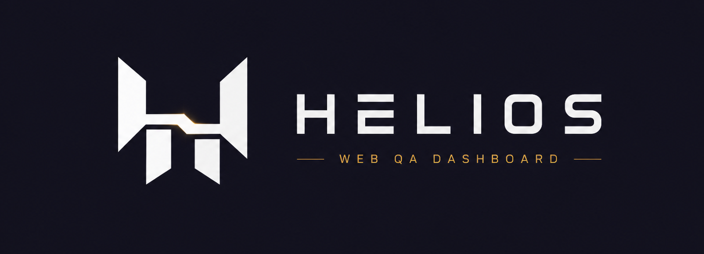

# Helios



Helios adalah QA observability dashboard untuk browser-based website checks. Fokus utamanya bukan cuma menemukan masalah, tapi membuat setiap QA run bisa diamati ulang lewat browser trail, screenshot, logs, artifacts, dan evidence.

> Evidence-based website QA powered by replayable browser runs.

## Core Loop

1. User memasukkan starting URL.
2. Helios membuat QA run.
3. Browser runner membuka halaman target.
4. Sistem mengumpulkan screenshot, console logs, network failures, dan trail steps.
5. Dashboard menampilkan summary, findings, artifacts, dan evidence yang bisa diinspeksi.

Untuk tahap awal, Helios belum fokus ke AI. Core pertamanya adalah dashboard dan automation pipeline yang stabil. Setelah evidence layer kuat, AI bisa ditambahkan untuk membuat report dan suggested next actions.

## MVP

- Input target URL
- Fake QA run lifecycle: queued, running, completed
- Browser trail/timeline
- Basic QA summary
- Screenshot desktop dan mobile
- Capture console errors
- Capture failed network requests
- Tampilkan report QA di dashboard

## Tech Stack

- Next.js
- TypeScript
- Tailwind CSS
- Playwright

## Development

Install dependencies:

```bash
npm install
```

Jalankan development server:

```bash
npm run dev
```

Buka app di browser:

```txt
http://localhost:3000
```

## Status

Masih tahap awal. Fokus sekarang adalah menyelesaikan prototype QA-first: dashboard shell, fake run lifecycle, browser trail, summary, dan state dasar sebelum masuk ke real Playwright runner.
